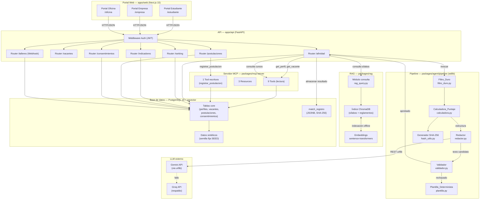
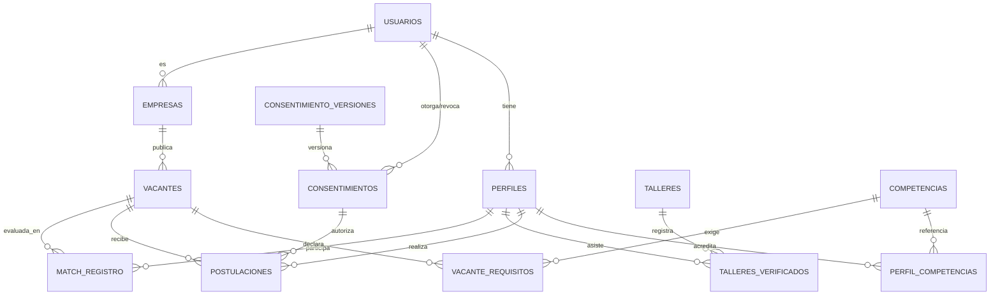
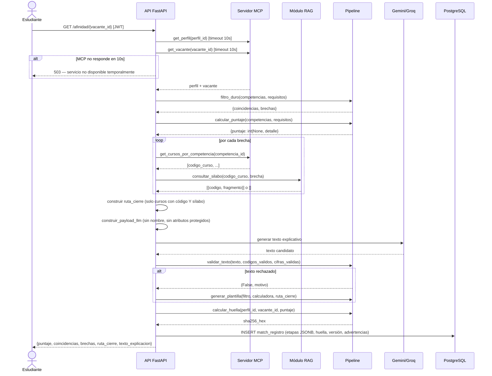
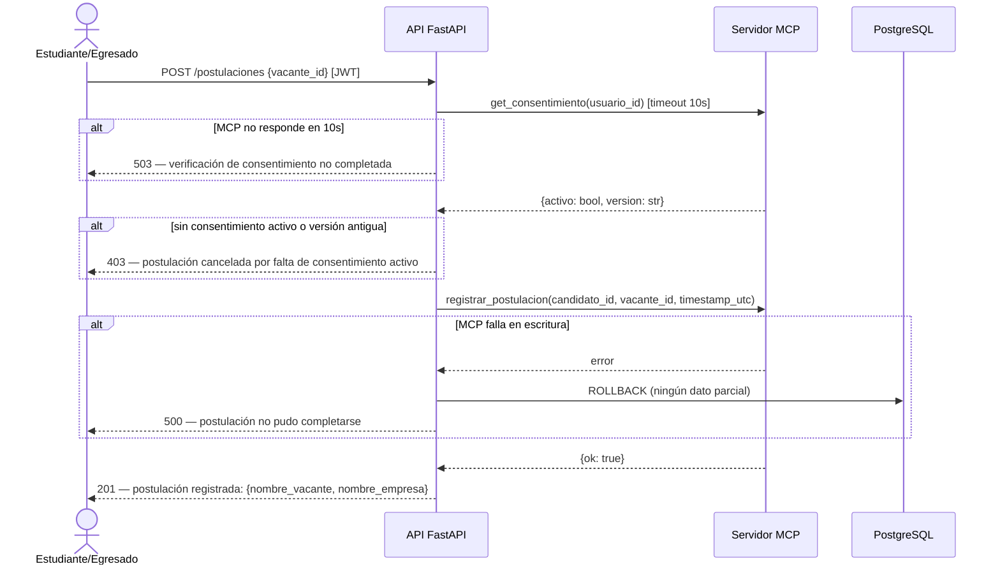
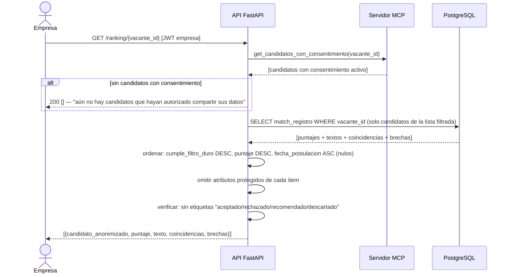
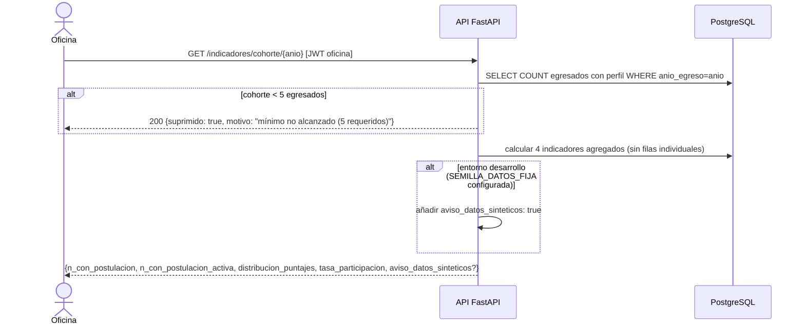
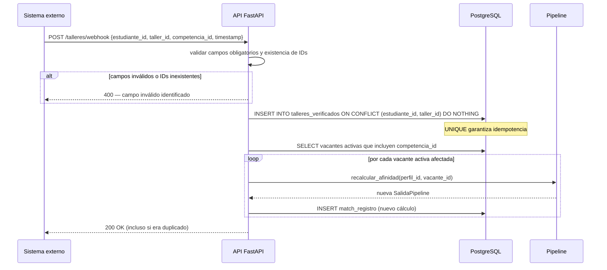

# Documento de Diseño Técnico — UNDC-Empleo

## Resumen ejecutivo

UNDC-Empleo es un asistente organizacional de empleabilidad para la Escuela Profesional de Ingeniería de Sistemas de la UNDC. Su núcleo es un **pipeline determinista de tres etapas** (filtro duro → calculadora de puntaje → redactor/validador) que calcula la afinidad entre un perfil académico y una vacante laboral usando exclusivamente aritmética `Decimal` y sin modelo de lenguaje en las etapas de cálculo. El modelo de lenguaje solo genera el texto explicativo sobre una estructura ya decidida.

---

## Overview

### Problema que resuelve

La Oficina de Seguimiento al Egresado (OSE) de la UNDC depende de encuestas anuales con baja tasa de respuesta para medir la empleabilidad de sus egresados. Los estudiantes y egresados no tienen una forma sistemática de conocer qué tan cerca están del perfil exigido por una vacante concreta, ni qué cursos de su propia universidad podrían cerrar esas brechas.

### Solución

Un sistema web que:

1. Traduce el perfil académico verificado a competencias comparables con vacantes reales.
2. Calcula de forma determinista y auditable la afinidad perfil-vacante.
3. Recomienda cursos de la UNDC con código y sílabo verificado para cerrar brechas.
4. Proporciona a empresas aliadas un ranking explicado y transparente de candidatos.
5. Entrega a la OSE indicadores agregados de colocación por cohorte.

### Principios de diseño

- **Determinismo total en el cálculo**: el mismo par `(perfil_id, vacante_id)` produce siempre el mismo puntaje y la misma huella SHA-256, en cualquier máquina.
- **El modelo solo redacta**: el LLM no calcula, no ordena, no decide. Recibe una estructura ya calculada y produce texto explicativo.
- **Nunca descarta candidatos**: el sistema ordena y explica; ubica al final a quien no cumple el filtro duro, con el motivo explícito.
- **Privacidad por diseño**: los atributos protegidos (edad, género, foto, distrito, colegio, estado civil) nunca se almacenan ni se exponen.
- **Código simple y legible**: sin microservicios, sin colas de mensajes, sin frameworks de agentes. Nivel universitario.
- **Costo cero en desarrollo**: solo servicios gratuitos o ejecución local.

---

## Architecture

### 2.1 Diagrama de componentes



### 2.2 Descripción de los componentes

| Componente | Ruta | Entorno virtual | Responsabilidad |
|---|---|---|---|
| **Portal Web** | `apps/web` | — (Node.js) | Tres portales SPA: estudiante, empresa, oficina. Consume la API REST. |
| **API FastAPI** | `apps/api` | `.venv` | Orquestador central. Autenticación JWT, enrutamiento por dominio, invoca pipeline, MCP y RAG. |
| **Pipeline** | `packages/agent/pipeline` | stdlib (importable desde los 3 entornos) | Filtro duro, calculadora de puntaje, redactor, validador, plantilla, hash SHA-256. Sin dependencias externas. |
| **Servidor MCP** | `packages/mcp-server` | `.venv-mcp` | Acceso de solo lectura a datos estructurados (9 tools, 3 resources). Única escritura: registrar postulación con verificación de consentimiento. |
| **Módulo RAG** | `packages/rag` | `.venv-rag` | Corpus de sílabos y reglamentos. Embeddings locales con sentence-transformers multilingüe. Índice vectorial ChromaDB. |
| **PostgreSQL 16** | Docker | — | Almacén principal. 24 tablas, JSONB para etapas del pipeline, pgvector para búsqueda vectorial futura. |
| **Generador de datos** | `data/sintetica/generador.py` | `.venv` | Genera datos sintéticos reproducibles con semilla fija `SEED`. Solo se usa en desarrollo. |
| **LLM externo** | nube gratuita | — | Gemini API (primario) y Groq (respaldo). Invocado por el Redactor vía `urllib` REST. Solo recibe la estructura calculada, nunca datos identificadores. |

---

## Components and Interfaces

### 3.1 Pipeline determinista

El pipeline es el núcleo del sistema. Es un módulo Python que usa solo la biblioteca estándar para ser importable desde los tres entornos virtuales sin conflictos de dependencias.

```
packages/agent/pipeline/
├── __init__.py
├── filtro_duro.py        # Etapa 1
├── calculadora.py        # Etapa 2
├── redactor.py           # Etapa 3a (invoca LLM)
├── validador.py          # Etapa 3b (revisa texto del LLM)
├── plantilla.py          # Etapa 3c (respaldo determinista)
├── hash_utils.py         # Generador Huella_SHA256
├── modelos.py            # Dataclasses de entrada/salida del pipeline
└── pipeline.py           # Orquestador de las tres etapas
```

**Interfaz pública del pipeline:**

```python
# packages/agent/pipeline/modelos.py
from dataclasses import dataclass, field
from decimal import Decimal
from typing import Optional

@dataclass
class RequisitoPerfil:
    competencia_id: str
    nivel_acreditado: str          # "aprobado", "asistencia_taller", etc.
    fuente: str                    # "historia_academica" | "taller_verificado"

@dataclass
class RequisitoVacante:
    competencia_id: str
    nivel_requerido: str
    tipo: str                      # "duro" | "deseable"
    peso: Decimal = Decimal("1.0")

@dataclass
class EntradaPipeline:
    perfil_id: str
    vacante_id: str
    competencias_perfil: list[RequisitoPerfil]
    requisitos_vacante: list[RequisitoVacante]
    version_pipeline: str          # "MAJOR.MINOR.PATCH"

@dataclass
class ResultadoFiltro:
    coincidencias: list[str]       # competencia_ids que cumplen requisitos duros
    brechas: list[str]             # competencia_ids faltantes en requisitos duros

@dataclass
class ResultadoCalculadora:
    puntaje: Optional[int]         # 0–100 o None si no hay requisitos/competencias
    puntaje_detalle: dict          # desglose por competencia en Decimal

@dataclass
class SalidaPipeline:
    perfil_id: str
    vacante_id: str
    filtro: ResultadoFiltro
    calculadora: ResultadoCalculadora
    texto_explicacion: str
    ruta_cierre: list[dict]        # [{"codigo": str, "nombre": str, "silabo_fragmento": str}]
    huella_sha256: str
    version_pipeline: str
    advertencias: list[str]        # códigos de cursos sin sílabo RAG
    plantilla_usada: bool
    motivo_rechazo_llm: Optional[str]
```

**Interfaz del orquestador:**

```python
# packages/agent/pipeline/pipeline.py
def calcular_afinidad(entrada: EntradaPipeline,
                      cursos_candidatos: list[dict],
                      silabos_rag: dict[str, str],
                      texto_llm: Optional[str] = None) -> SalidaPipeline:
    """
    Función pura. Recibe todos los datos ya recuperados por la API.
    No hace llamadas a red ni a base de datos.
    """
    ...
```

> **Decisión de diseño:** la API (no el pipeline) es responsable de recuperar datos del MCP, del RAG y del LLM. El pipeline recibe todo como parámetros y es una función pura. Esto garantiza testabilidad y determinismo.

### 3.2 Servidor MCP

```
packages/mcp-server/
├── server.py             # Punto de entrada MCP
├── tools/
│   ├── get_perfil.py
│   ├── get_vacante.py
│   ├── get_cursos_por_competencia.py
│   ├── get_consentimiento.py
│   ├── get_candidatos_con_consentimiento.py
│   ├── get_postulaciones_vacante.py
│   ├── get_indicadores_cohorte.py
│   ├── get_taller.py
│   ├── get_cohorte.py
│   └── registrar_postulacion.py   # Única escritura
└── resources/
    ├── vacantes_activas.py
    ├── empresas_aliadas.py
    └── cohortes.py
```

**Las 9 herramientas de lectura:**

| Tool | Descripción |
|---|---|
| `get_perfil(perfil_id)` | Devuelve competencias, cursos aprobados, talleres verificados. Nunca incluye atributos protegidos. |
| `get_vacante(vacante_id)` | Devuelve título, descripción y lista de requisitos con tipo y peso. |
| `get_cursos_por_competencia(competencia_id)` | Lista de códigos de curso que acreditan esa competencia. |
| `get_consentimiento(usuario_id)` | Estado actual del consentimiento `compartir_con_empresas` y su versión. |
| `get_candidatos_con_consentimiento(vacante_id)` | Lista de perfiles con consentimiento activo para una vacante. |
| `get_postulaciones_vacante(vacante_id)` | Postulaciones registradas para una vacante con timestamp. |
| `get_indicadores_cohorte(anio_egreso)` | Indicadores agregados de la cohorte (no filas individuales). |
| `get_taller(taller_id)` | Información del taller y competencia asociada. |
| `get_cohorte(anio_egreso)` | Metadatos de la cohorte (tamaño, año). |

**La única escritura:**

```python
registrar_postulacion(candidato_id: str, vacante_id: str, timestamp_utc: str) -> dict
# Verifica consentimiento antes de escribir. Lanza error si no está activo.
# Timestamp en formato ISO 8601 UTC: "2025-01-15T14:30:00Z"
```

### 3.3 Módulo RAG

```
packages/rag/
├── corpus/
│   ├── silabos/          # Archivos PDF/TXT de sílabos por código de curso
│   └── reglamentos/      # Reglamento académico y afines
├── indexador.py          # Script de indexación offline
├── rag_query.py          # Interfaz de consulta
└── config.py             # Configuración del modelo y ChromaDB
```

**Modelo de embedding:** `sentence-transformers/paraphrase-multilingual-mpnet-base-v2` (multilingüe, soporta español).

**Esquema de metadatos en ChromaDB:**

```python
{
    "documento": "CS301_silabo_2024.pdf",
    "codigo_curso": "CS301",
    "seccion": "Competencias",
    "texto": "Al finalizar el curso el estudiante será capaz de..."
}
```

**Interfaz de consulta:**

```python
# packages/rag/rag_query.py
def consultar_silabo(codigo_curso: str, brecha_descripcion: str,
                     top_k: int = 3) -> list[dict]:
    """
    Retorna fragmentos de sílabo relevantes para el código de curso dado.
    Retorna lista vacía si no encuentra fragmentos.
    Cada elemento: {"codigo_curso": str, "fragmento": str, "score": float}
    """
    ...
```

### 3.4 API FastAPI

```
apps/api/
├── main.py
├── auth/
│   ├── jwt_handler.py
│   └── dependencias.py
├── routers/
│   ├── afinidad.py
│   ├── vacantes.py
│   ├── postulaciones.py
│   ├── ranking.py
│   ├── indicadores.py
│   ├── consentimientos.py
│   └── talleres.py
├── servicios/
│   ├── pipeline_service.py     # Orquesta MCP + RAG + Pipeline + LLM
│   ├── llm_service.py          # Invoca Gemini/Groq via urllib
│   ├── consentimiento_service.py
│   └── indicadores_service.py
├── schemas/
│   ├── afinidad_schema.py
│   ├── vacante_schema.py
│   ├── ranking_schema.py
│   └── indicadores_schema.py   # Solo Indicadores_Agregados, sin filas individuales
└── db/
    ├── session.py
    └── modelos_orm.py
```

**Endpoints principales:**

| Método | Ruta | Rol | Descripción |
|---|---|---|---|
| `GET` | `/afinidad/{vacante_id}` | Estudiante, Egresado | Calcula y retorna afinidad completa con Ruta_Cierre |
| `POST` | `/postulaciones` | Estudiante, Egresado | Registra postulación (requiere consentimiento activo) |
| `GET` | `/postulaciones/mias` | Estudiante, Egresado | Lista postulaciones propias |
| `POST` | `/vacantes` | Empresa | Publica nueva vacante |
| `PUT` | `/vacantes/{vacante_id}` | Empresa (propietaria) | Actualiza vacante activa y dispara recálculo |
| `DELETE` | `/vacantes/{vacante_id}` | Empresa (propietaria) | Elimina vacante propia |
| `GET` | `/ranking/{vacante_id}` | Empresa | Ranking explicado de postulantes con consentimiento |
| `GET` | `/indicadores/cohorte/{anio}` | Oficina | Indicadores agregados por cohorte |
| `POST` | `/consentimientos/otorgar` | Estudiante, Egresado | Otorga consentimiento compartir_con_empresas |
| `POST` | `/consentimientos/revocar` | Estudiante, Egresado | Revoca consentimiento (efecto en ≤5s) |
| `POST` | `/talleres/webhook` | Sistema externo | Recibe evento de asistencia verificada a taller |

### 3.5 Portal Web

```
apps/web/
├── app/
│   ├── (auth)/
│   │   ├── login/page.tsx
│   │   └── layout.tsx
│   ├── estudiante/
│   │   ├── dashboard/page.tsx      # Resumen del perfil y postulaciones
│   │   ├── vacantes/page.tsx       # Listado de vacantes activas
│   │   ├── vacantes/[id]/page.tsx  # Detalle de afinidad con Ruta_Cierre
│   │   ├── postulaciones/page.tsx  # Mis postulaciones
│   │   └── consentimientos/page.tsx
│   ├── empresa/
│   │   ├── dashboard/page.tsx      # Mis vacantes
│   │   ├── vacantes/nueva/page.tsx # Formulario nueva vacante
│   │   ├── vacantes/[id]/edit/page.tsx
│   │   └── ranking/[vacante_id]/page.tsx  # Ranking de candidatos
│   └── oficina/
│       ├── dashboard/page.tsx      # Indicadores generales
│       └── cohorte/[anio]/page.tsx # Indicadores por cohorte con Recharts
├── components/
│   ├── afinidad/
│   │   ├── PuntajeCard.tsx
│   │   ├── BrechasList.tsx
│   │   └── RutaCierreList.tsx
│   ├── ranking/
│   │   └── RankingTable.tsx        # Sin etiquetas de decisión
│   └── indicadores/
│       ├── DistribucionChart.tsx   # Recharts
│       └── TasaParticipacion.tsx
└── lib/
    ├── api-client.ts
    └── auth.ts
```

**Páginas por rol:**

*Estudiante / Egresado:*
- Dashboard con perfil de competencias y postulaciones recientes
- Explorador de vacantes activas con puntaje de afinidad previo
- Detalle de afinidad: puntaje, coincidencias, brechas y Ruta_Cierre con sílabos
- Gestión de consentimientos (otorgar / revocar)

*Empresa aliada:*
- Dashboard de mis vacantes con estado (activa/cerrada)
- Formulario de nueva vacante con validación de requisitos
- Ranking de candidatos: ordenado por puntaje, sin etiquetas de decisión, sin atributos protegidos

*Oficina de Seguimiento al Egresado:*
- Dashboard con indicadores generales de todas las cohortes
- Vista por cohorte: gráficos Recharts (distribución de puntajes, tasa de participación)
- Aviso visible cuando los datos provienen de correlaciones sintéticas

---

## Data Models

### 4.1 Tablas principales

```sql
-- Usuarios (base de autenticación)
CREATE TABLE usuarios (
    id          UUID PRIMARY KEY DEFAULT gen_random_uuid(),
    email       VARCHAR(255) UNIQUE NOT NULL,
    password_hash VARCHAR(255) NOT NULL,
    rol         VARCHAR(20) NOT NULL CHECK (rol IN ('estudiante','egresado','empresa','oficina')),
    activo      BOOLEAN DEFAULT TRUE,
    creado_en   TIMESTAMPTZ DEFAULT NOW()
);

-- Perfiles de estudiantes y egresados
-- NOTA: ningún atributo protegido (edad, género, foto, distrito, colegio, estado_civil)
CREATE TABLE perfiles (
    id              UUID PRIMARY KEY DEFAULT gen_random_uuid(),
    usuario_id      UUID NOT NULL REFERENCES usuarios(id),
    nombre_display  VARCHAR(200) NOT NULL,   -- solo para mostrar al propio usuario
    anio_ingreso    INT,
    anio_egreso     INT,                     -- NULL si aún es estudiante activo
    creado_en       TIMESTAMPTZ DEFAULT NOW(),
    actualizado_en  TIMESTAMPTZ DEFAULT NOW()
);

-- Competencias acreditadas en el perfil (historia académica)
CREATE TABLE perfil_competencias (
    id              UUID PRIMARY KEY DEFAULT gen_random_uuid(),
    perfil_id       UUID NOT NULL REFERENCES perfiles(id),
    competencia_id  VARCHAR(100) NOT NULL,
    nivel           VARCHAR(50)  NOT NULL,   -- "basico", "intermedio", "avanzado"
    fuente          VARCHAR(30)  NOT NULL CHECK (fuente IN ('historia_academica','taller_verificado')),
    codigo_curso    VARCHAR(20),             -- NULL si fuente = 'taller_verificado'
    registrado_en   TIMESTAMPTZ DEFAULT NOW(),
    UNIQUE (perfil_id, competencia_id, fuente)
);

-- Empresas aliadas
CREATE TABLE empresas (
    id          UUID PRIMARY KEY DEFAULT gen_random_uuid(),
    usuario_id  UUID NOT NULL REFERENCES usuarios(id),
    razon_social VARCHAR(200) NOT NULL,
    ruc         VARCHAR(11) UNIQUE,
    creado_en   TIMESTAMPTZ DEFAULT NOW()
);

-- Vacantes
CREATE TABLE vacantes (
    id              UUID PRIMARY KEY DEFAULT gen_random_uuid(),
    empresa_id      UUID NOT NULL REFERENCES empresas(id),
    titulo          VARCHAR(150) NOT NULL,   -- 1–150 caracteres
    descripcion     TEXT NOT NULL,            -- 1–5000 caracteres
    estado          VARCHAR(20) NOT NULL CHECK (estado IN ('activa','cerrada','borrador')),
    version         INT DEFAULT 1,
    publicado_en    TIMESTAMPTZ DEFAULT NOW(),
    actualizado_en  TIMESTAMPTZ DEFAULT NOW()
);

-- Requisitos de las vacantes
CREATE TABLE vacante_requisitos (
    id              UUID PRIMARY KEY DEFAULT gen_random_uuid(),
    vacante_id      UUID NOT NULL REFERENCES vacantes(id) ON DELETE CASCADE,
    competencia_id  VARCHAR(100) NOT NULL,
    tipo            VARCHAR(10) NOT NULL CHECK (tipo IN ('duro','deseable')),
    nivel_requerido VARCHAR(50) NOT NULL,
    peso            NUMERIC(5,4) DEFAULT 1.0,
    UNIQUE (vacante_id, competencia_id)
);

-- Consentimientos versionados
CREATE TABLE consentimientos (
    id              UUID PRIMARY KEY DEFAULT gen_random_uuid(),
    usuario_id      UUID NOT NULL REFERENCES usuarios(id),
    tipo            VARCHAR(50) NOT NULL,    -- 'compartir_con_empresas'
    activo          BOOLEAN NOT NULL,
    version_texto   VARCHAR(20) NOT NULL,   -- version vigente del texto legal
    medio           VARCHAR(20) NOT NULL CHECK (medio IN ('web','api','importacion')),
    otorgado_en     TIMESTAMPTZ,            -- NULL si el primer registro es una revocación
    revocado_en     TIMESTAMPTZ,
    creado_en       TIMESTAMPTZ DEFAULT NOW()
);

-- Índice para verificación rápida del consentimiento activo vigente
CREATE INDEX idx_consentimientos_usuario_tipo_activo
    ON consentimientos (usuario_id, tipo, activo)
    WHERE activo = TRUE;

-- Versión vigente del texto de consentimiento
CREATE TABLE consentimiento_versiones (
    version         VARCHAR(20) PRIMARY KEY,
    texto           TEXT NOT NULL,
    vigente_desde   TIMESTAMPTZ NOT NULL,
    es_vigente      BOOLEAN DEFAULT FALSE
);

-- Postulaciones
CREATE TABLE postulaciones (
    id              UUID PRIMARY KEY DEFAULT gen_random_uuid(),
    perfil_id       UUID NOT NULL REFERENCES perfiles(id),
    vacante_id      UUID NOT NULL REFERENCES vacantes(id),
    estado          VARCHAR(20) DEFAULT 'registrada',
    timestamp_utc   TIMESTAMPTZ NOT NULL,
    consentimiento_id UUID NOT NULL REFERENCES consentimientos(id),
    UNIQUE (perfil_id, vacante_id)
);

-- Registro del pipeline (match_registro)
CREATE TABLE match_registro (
    id                  UUID PRIMARY KEY DEFAULT gen_random_uuid(),
    perfil_id           UUID NOT NULL REFERENCES perfiles(id),
    vacante_id          UUID NOT NULL REFERENCES vacantes(id),
    version_pipeline    VARCHAR(20) NOT NULL,          -- MAJOR.MINOR.PATCH
    resultado_filtro    JSONB NOT NULL,                -- salida del Filtro_Duro
    resultado_puntaje   JSONB NOT NULL,                -- salida de Calculadora_Puntaje
    resultado_texto     JSONB NOT NULL,                -- texto y metadatos del Redactor/Plantilla
    puntaje_final       INT,                           -- 0–100 o NULL
    huella_sha256       CHAR(64) NOT NULL,
    plantilla_usada     BOOLEAN DEFAULT FALSE,
    motivo_rechazo_llm  TEXT,
    advertencias        JSONB DEFAULT '[]'::jsonb,     -- array de códigos sin sílabo
    calculado_en        TIMESTAMPTZ DEFAULT NOW()
);

CREATE INDEX idx_match_registro_par
    ON match_registro (perfil_id, vacante_id);

-- Talleres verificados (eventos del webhook)
CREATE TABLE talleres_verificados (
    id              UUID PRIMARY KEY DEFAULT gen_random_uuid(),
    estudiante_id   UUID NOT NULL REFERENCES perfiles(id),
    taller_id       VARCHAR(100) NOT NULL,
    competencia_id  VARCHAR(100) NOT NULL,
    timestamp_evento TIMESTAMPTZ NOT NULL,             -- ISO 8601 del evento original
    registrado_en   TIMESTAMPTZ DEFAULT NOW(),
    UNIQUE (estudiante_id, taller_id)                  -- garantiza idempotencia
);

-- Catálogo de talleres
CREATE TABLE talleres (
    id              VARCHAR(100) PRIMARY KEY,
    nombre          VARCHAR(200) NOT NULL,
    competencia_id  VARCHAR(100) NOT NULL,
    activo          BOOLEAN DEFAULT TRUE
);

-- Catálogo de competencias
CREATE TABLE competencias (
    id              VARCHAR(100) PRIMARY KEY,
    nombre          VARCHAR(200) NOT NULL,
    descripcion     TEXT,
    area            VARCHAR(100)
);
```

### 4.2 Relaciones principales



---

### 5. Diseño del Pipeline determinista

### 5.1 Etapa 1 — Filtro_Duro

```python
# packages/agent/pipeline/filtro_duro.py
from .modelos import ResultadoFiltro, RequisitoPerfil, RequisitoVacante

def ejecutar_filtro_duro(
    competencias_perfil: list[RequisitoPerfil],
    requisitos_vacante: list[RequisitoVacante]
) -> ResultadoFiltro:
    """
    Función pura. Clasifica cada requisito DURO de la vacante como
    coincidencia o brecha según las competencias del perfil.
    Los requisitos DESEABLES no generan brechas; solo contribuyen al puntaje.
    """
    ids_perfil = {c.competencia_id for c in competencias_perfil}
    requisitos_duros = [r for r in requisitos_vacante if r.tipo == "duro"]

    coincidencias = [r.competencia_id for r in requisitos_duros
                     if r.competencia_id in ids_perfil]
    brechas = [r.competencia_id for r in requisitos_duros
               if r.competencia_id not in ids_perfil]

    return ResultadoFiltro(coincidencias=coincidencias, brechas=brechas)
```

**Invariante garantizado:** `len(coincidencias) + len(brechas) == len(requisitos_duros)`.

### 5.2 Etapa 2 — Calculadora_Puntaje

```python
# packages/agent/pipeline/calculadora.py
from decimal import Decimal, ROUND_HALF_UP
from typing import Optional
from .modelos import ResultadoCalculadora, RequisitoPerfil, RequisitoVacante

_CUATRO_DECIMALES = Decimal("0.0001")
_CERO = Decimal("0")
_CIEN = Decimal("100")

def calcular_puntaje(
    competencias_perfil: list[RequisitoPerfil],
    requisitos_vacante: list[RequisitoVacante]
) -> ResultadoCalculadora:
    """
    Función pura. Aritmética exclusivamente con Decimal y ROUND_HALF_UP.
    Retorna puntaje=None si la vacante no tiene requisitos o el perfil no tiene
    competencias, en lugar de inventar un número.
    """
    if not requisitos_vacante:
        return ResultadoCalculadora(puntaje=None, puntaje_detalle={})
    if not competencias_perfil:
        return ResultadoCalculadora(puntaje=None, puntaje_detalle={})

    ids_perfil = {c.competencia_id for c in competencias_perfil}
    peso_total = _CERO
    peso_cubierto = _CERO
    detalle = {}

    for req in requisitos_vacante:
        peso = Decimal(str(req.peso)).quantize(_CUATRO_DECIMALES, ROUND_HALF_UP)
        peso_total = (peso_total + peso).quantize(_CUATRO_DECIMALES, ROUND_HALF_UP)
        cubierto = req.competencia_id in ids_perfil
        aporte = peso if cubierto else _CERO
        peso_cubierto = (peso_cubierto + aporte).quantize(_CUATRO_DECIMALES, ROUND_HALF_UP)
        detalle[req.competencia_id] = {"peso": str(peso), "cubierto": cubierto}

    if peso_total == _CERO:
        return ResultadoCalculadora(puntaje=None, puntaje_detalle=detalle)

    puntaje_decimal = (peso_cubierto / peso_total * _CIEN).quantize(
        _CUATRO_DECIMALES, ROUND_HALF_UP
    )
    puntaje_entero = int(puntaje_decimal.quantize(Decimal("1"), ROUND_HALF_UP))

    return ResultadoCalculadora(
        puntaje=puntaje_entero,
        puntaje_detalle=detalle
    )
```

**Garantías:**
- Ningún operador usa `float` nativo.
- Cada operación intermedia se redondea a 4 decimales con `ROUND_HALF_UP`.
- El resultado final se convierte a `int` con redondeo explícito.
- El resultado es siempre `None` o un entero en `[0, 100]`.

### 5.3 Generador de Huella_SHA256

```python
# packages/agent/pipeline/hash_utils.py
import hashlib

def calcular_huella(perfil_id: str, vacante_id: str, puntaje: int | None) -> str:
    """
    Serialización canónica: "perfil_id|vacante_id|puntaje"
    donde puntaje es el entero final (0–100) o la cadena "None".
    Determinista en cualquier máquina con Python 3.11+.
    """
    puntaje_str = str(puntaje) if puntaje is not None else "None"
    cadena = f"{perfil_id}|{vacante_id}|{puntaje_str}"
    return hashlib.sha256(cadena.encode("utf-8")).hexdigest()
```

### 5.4 Etapa 3 — Redactor, Validador y Plantilla_Determinista

```python
# packages/agent/pipeline/redactor.py
import json
import urllib.request
import urllib.error
from .modelos import ResultadoFiltro, ResultadoCalculadora

_ATRIBUTOS_PROTEGIDOS = {"edad", "genero", "foto", "distrito", "colegio", "estado_civil"}

def construir_payload_llm(
    filtro: ResultadoFiltro,
    calculadora: ResultadoCalculadora,
    ruta_cierre: list[dict]
) -> dict:
    """
    Construye el payload para el LLM.
    NUNCA incluye nombre, código de estudiante ni atributos protegidos.
    """
    return {
        "coincidencias": filtro.coincidencias,
        "brechas": filtro.brechas,
        "puntaje": calculadora.puntaje,
        "ruta_cierre": [
            {"codigo": c["codigo"], "nombre": c["nombre"],
             "silabo_fragmento": c["silabo_fragmento"]}
            for c in ruta_cierre
        ]
    }

def redactar_con_llm(payload: dict, gemini_key: str | None,
                     groq_key: str | None) -> str | None:
    """
    Invoca Gemini (primario) o Groq (respaldo) vía urllib REST.
    Retorna None si no hay claves configuradas o si la llamada falla.
    """
    if not gemini_key and not groq_key:
        return None
    prompt = _construir_prompt(payload)
    if gemini_key:
        texto = _llamar_gemini(prompt, gemini_key)
        if texto:
            return texto
    if groq_key:
        return _llamar_groq(prompt, groq_key)
    return None

def _llamar_gemini(prompt: str, api_key: str) -> str | None:
    url = (
        f"https://generativelanguage.googleapis.com/v1beta/models/"
        f"gemini-2.0-flash:generateContent?key={api_key}"
    )
    cuerpo = json.dumps({"contents": [{"parts": [{"text": prompt}]}]}).encode("utf-8")
    try:
        req = urllib.request.Request(url, data=cuerpo,
                                     headers={"Content-Type": "application/json"})
        with urllib.request.urlopen(req, timeout=15) as resp:
            data = json.loads(resp.read())
            return data["candidates"][0]["content"]["parts"][0]["text"]
    except Exception:
        return None
```

```python
# packages/agent/pipeline/validador.py
import re

_PROHIBICIONES = [
    # Promesas de empleo
    (r"\b(garantizamos|aseguramos|conseguirás|obtendrás)\s+(empleo|trabajo|colocación)\b",
     "promesa_empleo"),
    # Descarte explícito
    (r"\b(descartado|rechazado|no apto|no califica|no recomendado)\b",
     "descarte_candidato"),
    # Atributos protegidos
    (r"\b(edad|género|foto|distrito|colegio|estado civil)\b",
     "atributo_protegido"),
]

def validar_texto(texto: str, codigos_validos: set[str],
                  cifras_validas: set[str]) -> tuple[bool, str | None]:
    """
    Retorna (es_valido, motivo_rechazo).
    Rechaza si el texto contiene cifras no presentes en la estructura de entrada,
    códigos de curso no registrados en el MCP, promesas de empleo,
    descarte del candidato, o mención de atributos protegidos.
    """
    texto_lower = texto.lower()

    # Verificar atributos protegidos, promesas y descarte
    for patron, motivo in _PROHIBICIONES:
        if re.search(patron, texto_lower):
            return False, motivo

    # Verificar códigos de curso no registrados
    codigos_en_texto = set(re.findall(r"\b[A-Z]{2,4}\d{3}\b", texto))
    codigos_inventados = codigos_en_texto - codigos_validos
    if codigos_inventados:
        return False, f"codigos_inventados:{','.join(sorted(codigos_inventados))}"

    # Verificar cifras porcentuales no presentes en la estructura
    cifras_en_texto = set(re.findall(r"\b\d{1,3}(?:\.\d+)?%?\b", texto))
    cifras_inventadas = cifras_en_texto - cifras_validas
    if cifras_inventadas:
        return False, f"cifras_inventadas:{','.join(sorted(cifras_inventadas))}"

    return True, None
```

```python
# packages/agent/pipeline/plantilla.py
from .modelos import ResultadoFiltro, ResultadoCalculadora

def generar_plantilla(filtro: ResultadoFiltro,
                      calculadora: ResultadoCalculadora,
                      ruta_cierre: list[dict]) -> str:
    """Genera texto explicativo determinista sin invocar ningún modelo."""
    puntaje = calculadora.puntaje

    if puntaje is None:
        return (
            "No fue posible calcular el puntaje de afinidad porque la vacante "
            "no declaró requisitos o el perfil no tiene competencias registradas."
        )

    partes = [f"Puntaje de afinidad: {puntaje}/100."]

    if filtro.coincidencias:
        partes.append(
            f"Requisitos cumplidos: {', '.join(filtro.coincidencias)}."
        )
    else:
        partes.append("No se encontraron coincidencias con los requisitos de la vacante.")

    if filtro.brechas:
        partes.append(f"Brechas identificadas: {', '.join(filtro.brechas)}.")
        if ruta_cierre:
            cursos = ", ".join(
                f"{c['codigo']} — {c['nombre']}" for c in ruta_cierre
            )
            partes.append(f"Cursos recomendados para cerrar brechas: {cursos}.")
        else:
            partes.append(
                "No se encontraron cursos con código y sílabo verificado "
                "para las brechas identificadas."
            )

    return " ".join(partes)
```

---

### 6. Flujos de datos principales

### 6.1 Flujo de cálculo de afinidad



### 6.2 Flujo de postulación



### 6.3 Flujo de ranking para empresa



### 6.4 Flujo de indicadores OSE



### 6.5 Flujo de webhook de talleres



---

## Error Handling

### 7.1 Principios generales

- Todos los errores se retornan en formato JSON con los campos `{"error": str, "detalle": str}`.
- Los errores de timeout del MCP generan respuesta `503` con mensaje en lenguaje natural para el usuario.
- Los errores de validación del Validador no interrumpen el flujo: el sistema continúa con la Plantilla_Determinista.
- Los errores de indisponibilidad del RAG no interrumpen el cálculo: se omite la Ruta_Cierre afectada y se registra en `advertencias`.
- Ningún error expone trazas de pila internas al usuario final.

### 7.2 Tabla de respuestas de error

| Situación | Código HTTP | Acción del sistema |
|---|---|---|
| MCP timeout (>10s) en afinidad | 503 | Cancela cálculo, informa al usuario |
| Sin requisitos en vacante | 200 | `puntaje=null`, solicita aclaración |
| Sin competencias en perfil | 200 | `puntaje=null`, informa al usuario |
| Validador rechaza texto LLM | 200 | Usa Plantilla_Determinista, registra motivo |
| Sin claves LLM configuradas | 200 | Usa Plantilla_Determinista directamente |
| RAG no encuentra sílabo | 200 | Excluye curso, declara en respuesta, registra en advertencias |
| Sin consentimiento activo | 403 | Bloquea operación, informa qué acción se requiere |
| Consentimiento versión antigua | 403 | Trata como inactivo, requiere re-otorgamiento |
| MCP timeout en verificación consentimiento (>3s) | 503 | Deniega operación, no transmite datos |
| Escritura MCP falla en postulación | 500 | Rollback completo, informa al usuario |
| Vacante sin requisito clasificado | 422 | Rechaza registro, conserva datos para corrección |
| Empresa intenta modificar vacante ajena | 403 | Rechaza operación, vacante sin cambios |
| Cohorte con <5 egresados | 200 | Suprime todos los indicadores, informa mínimo |
| Webhook con campos ausentes/IDs inválidos | 400 | Rechaza evento, identifica campo inválido |

### 7.3 Fallback encadenado del LLM

```
1. Intentar Gemini API (primario, GEMINI_API_KEY)
   └─ falla/timeout → Intentar Groq (respaldo, GROQ_API_KEY)
        └─ falla/timeout → usar Plantilla_Determinista
             └─ sin claves configuradas → usar Plantilla_Determinista directamente
```

---

## Testing Strategy

### 8.1 Enfoque dual

El sistema emplea dos tipos complementarios de pruebas:

- **Pruebas unitarias con ejemplos**: verifican comportamientos específicos, casos de borde y condiciones de error.
- **Pruebas basadas en propiedades (PBT)** con [Hypothesis](https://hypothesis.readthedocs.io/): verifican propiedades universales que deben mantenerse para cualquier entrada válida.

Ambas son necesarias: las unitarias atrapan errores concretos, las de propiedad verifican la corrección general.

### 8.2 Estructura de pruebas

```
tests/
├── unit/
│   ├── test_filtro_duro.py
│   ├── test_calculadora.py
│   ├── test_validador.py
│   ├── test_plantilla.py
│   ├── test_hash_utils.py
│   ├── test_consentimiento_service.py
│   └── test_rag_query.py
├── properties/
│   ├── test_pipeline_properties.py     # Propiedades 1–5
│   ├── test_privacidad_properties.py   # Propiedades 6–8
│   ├── test_ranking_properties.py      # Propiedades 9–13
│   └── test_webhook_properties.py      # Propiedades 14–16
├── integration/
│   ├── test_api_afinidad.py
│   ├── test_api_postulacion.py
│   └── test_determinismo.py           # Verifica huella MCP == huella SQL
└── casos-agente/                      # Casos ejecutables para scripts/verificar.ps1
    ├── caso_01_afinidad_completa.py
    ├── caso_02_postulacion_sin_consentimiento.py
    └── ...
```

### 8.3 Configuración de Hypothesis

```python
# tests/conftest.py
from hypothesis import settings

settings.register_profile("ci", max_examples=100)
settings.register_profile("dev", max_examples=50)
settings.load_profile("ci")
```

### 8.4 Bibliotecas

- **Pruebas de propiedad**: [Hypothesis](https://hypothesis.readthedocs.io/) para Python.
- **Pruebas unitarias e integración**: `pytest` + `pytest-asyncio` para endpoints FastAPI.
- **Mocks**: `unittest.mock` (stdlib) para simular MCP, RAG y LLM.

---

## Correctness Properties

*Una propiedad es una característica o comportamiento que debe mantenerse verdadero en todas las ejecuciones válidas de un sistema — esencialmente, un enunciado formal sobre lo que el sistema debe hacer. Las propiedades sirven como puente entre las especificaciones legibles por humanos y las garantías de corrección verificables por máquina.*

---

### Propiedad 1: Partición completa del filtro duro

*Para cualquier* par de listas de competencias de perfil y requisitos de vacante, el Filtro_Duro debe clasificar cada requisito duro exactamente como coincidencia **o** brecha, de modo que la unión de ambas listas sea igual al total de requisitos duros sin duplicados.

**Valida: Requisito 1.3**

```python
# tests/properties/test_pipeline_properties.py
# Feature: undc-empleo, Propiedad 1: particion_completa_filtro_duro

from hypothesis import given, settings
from hypothesis import strategies as st
from packages.agent.pipeline.filtro_duro import ejecutar_filtro_duro
from packages.agent.pipeline.modelos import RequisitoPerfil, RequisitoVacante
from decimal import Decimal

competencia_id_st = st.text(
    alphabet=st.characters(whitelist_categories=("Lu", "Ll", "Nd")),
    min_size=3, max_size=20
)

@st.composite
def perfil_st(draw):
    ids = draw(st.lists(competencia_id_st, min_size=0, max_size=15, unique=True))
    return [
        RequisitoPerfil(competencia_id=cid, nivel_acreditado="aprobado",
                        fuente="historia_academica")
        for cid in ids
    ]

@st.composite
def vacante_requisitos_st(draw):
    ids = draw(st.lists(competencia_id_st, min_size=0, max_size=10, unique=True))
    return [
        RequisitoVacante(
            competencia_id=cid,
            nivel_requerido="basico",
            tipo=draw(st.sampled_from(["duro", "deseable"])),
            peso=Decimal("1.0")
        )
        for cid in ids
    ]

@given(perfil_st(), vacante_requisitos_st())
@settings(max_examples=100)
def test_filtro_duro_particion_completa(competencias, requisitos):
    """
    Feature: undc-empleo, Propiedad 1: particion_completa_filtro_duro
    Para cualquier perfil y vacante, coincidencias ∪ brechas == todos los requisitos duros
    sin duplicados.
    """
    resultado = ejecutar_filtro_duro(competencias, requisitos)
    requisitos_duros_ids = {r.competencia_id for r in requisitos if r.tipo == "duro"}
    union = set(resultado.coincidencias) | set(resultado.brechas)
    interseccion = set(resultado.coincidencias) & set(resultado.brechas)

    assert union == requisitos_duros_ids, (
        "La unión de coincidencias y brechas debe ser igual al conjunto de requisitos duros"
    )
    assert len(interseccion) == 0, (
        "Un requisito duro no puede ser coincidencia y brecha al mismo tiempo"
    )
    assert len(resultado.coincidencias) + len(resultado.brechas) == len(requisitos_duros_ids), (
        "La cantidad total debe ser igual al número de requisitos duros"
    )
```

---

### Propiedad 2: Puntaje en rango válido

*Para cualquier* par de listas de competencias y requisitos de vacante con al menos un requisito y al menos una competencia, la Calculadora_Puntaje debe retornar un entero en el rango `[0, 100]`.

**Valida: Requisito 1.4, 10.1**

```python
# Feature: undc-empleo, Propiedad 2: puntaje_en_rango_valido
from hypothesis import given, settings
from hypothesis import strategies as st
from packages.agent.pipeline.calculadora import calcular_puntaje

@given(perfil_st(), vacante_requisitos_st())
@settings(max_examples=100)
def test_puntaje_en_rango(competencias, requisitos):
    """
    Feature: undc-empleo, Propiedad 2: puntaje_en_rango_valido
    Cuando hay requisitos y competencias, el puntaje es un entero en [0, 100].
    """
    resultado = calcular_puntaje(competencias, requisitos)

    if not competencias or not requisitos:
        assert resultado.puntaje is None
    else:
        if resultado.puntaje is not None:
            assert isinstance(resultado.puntaje, int), "El puntaje debe ser un entero"
            assert 0 <= resultado.puntaje <= 100, (
                f"Puntaje {resultado.puntaje} fuera del rango [0, 100]"
            )
```

---

### Propiedad 3: Determinismo de la Huella_SHA256

*Para cualquier* trío `(perfil_id, vacante_id, puntaje)`, calcular la huella dos veces consecutivas debe producir exactamente el mismo valor hexadecimal de 64 caracteres.

**Valida: Requisito 1.5, 10.2, 9.6**

```python
# Feature: undc-empleo, Propiedad 3: determinismo_huella_sha256
from hypothesis import given, settings
from hypothesis import strategies as st
from packages.agent.pipeline.hash_utils import calcular_huella

uuid_st = st.uuids().map(str)
puntaje_st = st.one_of(st.none(), st.integers(min_value=0, max_value=100))

@given(uuid_st, uuid_st, puntaje_st)
@settings(max_examples=100)
def test_huella_determinista(perfil_id, vacante_id, puntaje):
    """
    Feature: undc-empleo, Propiedad 3: determinismo_huella_sha256
    Calcular la huella dos veces con los mismos inputs produce el mismo resultado.
    """
    huella1 = calcular_huella(perfil_id, vacante_id, puntaje)
    huella2 = calcular_huella(perfil_id, vacante_id, puntaje)

    assert huella1 == huella2, "La huella SHA-256 debe ser idéntica en dos llamadas sucesivas"
    assert len(huella1) == 64, "La huella SHA-256 debe tener exactamente 64 caracteres hex"
    assert all(c in "0123456789abcdef" for c in huella1), (
        "La huella debe ser una cadena hexadecimal en minúsculas"
    )
```

---

### Propiedad 4: Respuesta completa de afinidad

*Para cualquier* par `(perfil_id, vacante_id)` con puntaje calculable (perfil con competencias y vacante con requisitos), la estructura de salida del pipeline debe contener los cuatro campos obligatorios: `puntaje`, `coincidencias`, `brechas` y `ruta_cierre`.

**Valida: Requisito 1.9**

```python
# Feature: undc-empleo, Propiedad 4: respuesta_completa_afinidad
from hypothesis import given, settings
from hypothesis import strategies as st
from packages.agent.pipeline.pipeline import calcular_afinidad

@given(perfil_st(), vacante_requisitos_st())
@settings(max_examples=100)
def test_respuesta_tiene_campos_obligatorios(competencias, requisitos):
    """
    Feature: undc-empleo, Propiedad 4: respuesta_completa_afinidad
    La SalidaPipeline siempre tiene puntaje, coincidencias, brechas y ruta_cierre definidos.
    """
    from packages.agent.pipeline.modelos import EntradaPipeline
    from decimal import Decimal

    entrada = EntradaPipeline(
        perfil_id="p-test",
        vacante_id="v-test",
        competencias_perfil=competencias,
        requisitos_vacante=requisitos,
        version_pipeline="1.0.0"
    )
    salida = calcular_afinidad(
        entrada=entrada,
        cursos_candidatos=[],
        silabos_rag={},
        texto_llm=None
    )

    assert hasattr(salida, "filtro"), "Falta campo 'filtro' (coincidencias, brechas)"
    assert hasattr(salida, "calculadora"), "Falta campo 'calculadora' (puntaje)"
    assert hasattr(salida, "ruta_cierre"), "Falta campo 'ruta_cierre'"
    assert hasattr(salida, "texto_explicacion"), "Falta campo 'texto_explicacion'"
    assert isinstance(salida.ruta_cierre, list), "'ruta_cierre' debe ser una lista"
```

---

### Propiedad 5: Ausencia de atributos protegidos en payload al LLM

*Para cualquier* perfil generado con cualquier combinación de campos (incluyendo atributos protegidos), el payload construido para el Redactor nunca debe contener los campos `edad`, `genero`, `foto`, `distrito`, `colegio` ni `estado_civil`.

**Valida: Requisito 2.2, 4.5**

```python
# Feature: undc-empleo, Propiedad 5: ausencia_atributos_protegidos_en_llm
import json
from hypothesis import given, settings
from hypothesis import strategies as st
from packages.agent.pipeline.redactor import construir_payload_llm
from packages.agent.pipeline.modelos import ResultadoFiltro, ResultadoCalculadora

_PROTEGIDOS = {"edad", "genero", "género", "foto", "distrito", "colegio", "estado_civil",
               "estado civil"}

@st.composite
def estructura_afinidad_st(draw):
    n_coincidencias = draw(st.integers(min_value=0, max_value=5))
    n_brechas = draw(st.integers(min_value=0, max_value=5))
    coincidencias = [f"COMP{i:03d}" for i in range(n_coincidencias)]
    brechas = [f"COMP{i+100:03d}" for i in range(n_brechas)]
    puntaje = draw(st.one_of(st.none(), st.integers(0, 100)))
    return (
        ResultadoFiltro(coincidencias=coincidencias, brechas=brechas),
        ResultadoCalculadora(puntaje=puntaje, puntaje_detalle={}),
        []
    )

@given(estructura_afinidad_st())
@settings(max_examples=100)
def test_payload_llm_sin_atributos_protegidos(estructura):
    """
    Feature: undc-empleo, Propiedad 5: ausencia_atributos_protegidos_en_llm
    El payload enviado al LLM nunca contiene atributos protegidos.
    """
    filtro, calculadora, ruta_cierre = estructura
    payload = construir_payload_llm(filtro, calculadora, ruta_cierre)
    payload_json = json.dumps(payload).lower()

    for atributo in _PROTEGIDOS:
        assert atributo not in payload_json, (
            f"Atributo protegido '{atributo}' encontrado en payload del LLM"
        )
    assert "nombre" not in payload_json, (
        "El nombre del candidato no debe aparecer en el payload del LLM"
    )
```

---

### Propiedad 6: Validador rechaza todas las condiciones prohibidas

*Para cualquier* texto que contenga al menos una de las cinco condiciones prohibidas (cifras inventadas, códigos inexistentes, promesas de empleo, descarte explícito, atributos protegidos), el Validador debe retornar `es_valido=False` con un motivo de rechazo no nulo.

**Valida: Requisito 2.3**

```python
# Feature: undc-empleo, Propiedad 6: validador_rechaza_condiciones_prohibidas
from hypothesis import given, settings, assume
from hypothesis import strategies as st
from packages.agent.pipeline.validador import validar_texto

_TEXTOS_PROHIBIDOS = [
    "garantizamos empleo al finalizar",
    "candidato descartado por falta de experiencia",
    "el candidato fue rechazado del proceso",
    "edad del candidato: 25 años",
    "género femenino presentó su aplicación",
    "el candidato fue fotografiado en la entrevista",
    "vive en el distrito de Miraflores",
    "estudió en el colegio San Marcos",
    "estado civil casado registrado",
]

@given(st.sampled_from(_TEXTOS_PROHIBIDOS))
@settings(max_examples=100)
def test_validador_rechaza_textos_prohibidos(texto_prohibido):
    """
    Feature: undc-empleo, Propiedad 6: validador_rechaza_condiciones_prohibidas
    Cualquier texto con al menos una condición prohibida debe ser rechazado.
    """
    es_valido, motivo = validar_texto(
        texto=texto_prohibido,
        codigos_validos=set(),
        cifras_validas=set()
    )
    assert not es_valido, (
        f"El Validador debería rechazar el texto: '{texto_prohibido[:50]}...'"
    )
    assert motivo is not None, "El motivo de rechazo no debe ser None"
    assert len(motivo) > 0, "El motivo de rechazo no debe ser vacío"
```

---

### Propiedad 7: Ruta_Cierre solo incluye cursos con código y sílabo

*Para cualquier* lista de cursos candidatos donde algunos tienen código registrado en el MCP y sílabo en el RAG y otros no, la Ruta_Cierre resultante debe contener **únicamente** los cursos que cumplen ambas condiciones.

**Valida: Requisito 3.2, 3.4**

```python
# Feature: undc-empleo, Propiedad 7: ruta_cierre_solo_cursos_verificados
from hypothesis import given, settings
from hypothesis import strategies as st

@st.composite
def cursos_candidatos_st(draw):
    n = draw(st.integers(min_value=0, max_value=10))
    cursos = []
    for i in range(n):
        tiene_codigo = draw(st.booleans())
        tiene_silabo = draw(st.booleans())
        cursos.append({
            "codigo": f"CS{i:03d}" if tiene_codigo else None,
            "nombre": f"Curso {i}",
            "tiene_silabo": tiene_silabo,
            "silabo_fragmento": f"Fragmento {i}" if tiene_silabo else None
        })
    return cursos

def construir_ruta_cierre(cursos_candidatos: list[dict]) -> list[dict]:
    """Lógica de filtrado que se prueba."""
    return [
        c for c in cursos_candidatos
        if c.get("codigo") is not None and c.get("silabo_fragmento")
    ]

@given(cursos_candidatos_st())
@settings(max_examples=100)
def test_ruta_cierre_solo_cursos_verificados(cursos):
    """
    Feature: undc-empleo, Propiedad 7: ruta_cierre_solo_cursos_verificados
    La Ruta_Cierre solo contiene cursos con código MCP y sílabo RAG.
    """
    ruta = construir_ruta_cierre(cursos)

    for curso in ruta:
        assert curso["codigo"] is not None, (
            f"Curso en ruta_cierre sin código MCP: {curso}"
        )
        assert curso["silabo_fragmento"] is not None and curso["silabo_fragmento"] != "", (
            f"Curso en ruta_cierre sin fragmento de sílabo RAG: {curso}"
        )
```

---

### Propiedad 8: Consentimiento verificado en las tres operaciones críticas

*Para cualquier* usuario sin consentimiento `compartir_con_empresas` activo, cualquiera de las tres operaciones que requieren consentimiento (postular, listar candidatos, registrar postulación) debe ser bloqueada sin transmitir datos del perfil.

**Valida: Requisito 4.1, 4.2, 6.1**

```python
# Feature: undc-empleo, Propiedad 8: consentimiento_verifica_tres_operaciones
from hypothesis import given, settings
from hypothesis import strategies as st
from unittest.mock import MagicMock

operacion_st = st.sampled_from(["postular", "listar_candidatos", "registrar_postulacion"])

@given(operacion_st, st.booleans(), st.text(min_size=1, max_size=20))
@settings(max_examples=100)
def test_consentimiento_bloquea_sin_activo(operacion, consentimiento_activo, usuario_id):
    """
    Feature: undc-empleo, Propiedad 8: consentimiento_verifica_tres_operaciones
    Sin consentimiento activo, las tres operaciones críticas deben bloquearse.
    """
    from apps.api.servicios.consentimiento_service import verificar_consentimiento

    mock_mcp = MagicMock()
    mock_mcp.get_consentimiento.return_value = {
        "activo": consentimiento_activo,
        "version": "1.0"
    }

    resultado = verificar_consentimiento(
        usuario_id=usuario_id,
        operacion=operacion,
        mcp_client=mock_mcp,
        version_vigente="1.0"
    )

    if not consentimiento_activo:
        assert resultado["permitido"] is False, (
            f"La operación '{operacion}' debe bloquearse sin consentimiento activo"
        )
        assert resultado.get("datos_transmitidos") is False or \
               "datos_transmitidos" not in resultado, (
            "No deben transmitirse datos sin consentimiento activo"
        )
```

---

### Propiedad 9: Vacante válida acepta y vacante inválida rechaza

*Para cualquier* vacante con título de longitud en `[1, 150]`, descripción en `[1, 5000]` y al menos un requisito clasificado, el sistema debe aceptarla. Para cualquier combinación que viole al menos una de estas reglas, debe rechazarla.

**Valida: Requisito 5.1, 5.2**

```python
# Feature: undc-empleo, Propiedad 9: validacion_schema_vacante
from hypothesis import given, settings, assume
from hypothesis import strategies as st

texto_st = st.text(alphabet=st.characters(whitelist_categories=("L", "N", "Z", "P")),
                   min_size=1)

@st.composite
def vacante_valida_st(draw):
    titulo = draw(texto_st.filter(lambda t: 1 <= len(t) <= 150))
    descripcion = draw(texto_st.filter(lambda t: 1 <= len(t) <= 5000))
    n_requisitos = draw(st.integers(min_value=1, max_value=10))
    requisitos = [{"competencia_id": f"COMP{i}", "tipo": "duro"} for i in range(n_requisitos)]
    return {"titulo": titulo, "descripcion": descripcion, "requisitos": requisitos}

@st.composite
def vacante_invalida_st(draw):
    tipo_error = draw(st.sampled_from(["sin_titulo", "titulo_largo", "sin_requisitos",
                                       "descripcion_larga"]))
    if tipo_error == "sin_titulo":
        return {"titulo": "", "descripcion": "Descripción válida", "requisitos": [{"competencia_id": "C1", "tipo": "duro"}]}
    elif tipo_error == "titulo_largo":
        titulo = draw(texto_st.filter(lambda t: len(t) > 150))
        return {"titulo": titulo, "descripcion": "Descripción válida", "requisitos": [{"competencia_id": "C1", "tipo": "duro"}]}
    elif tipo_error == "sin_requisitos":
        return {"titulo": "Título válido", "descripcion": "Descripción válida", "requisitos": []}
    else:
        desc = draw(texto_st.filter(lambda t: len(t) > 5000))
        return {"titulo": "Título válido", "descripcion": desc, "requisitos": [{"competencia_id": "C1", "tipo": "duro"}]}

def validar_vacante(datos: dict) -> bool:
    return (
        1 <= len(datos.get("titulo", "")) <= 150
        and 1 <= len(datos.get("descripcion", "")) <= 5000
        and len(datos.get("requisitos", [])) >= 1
    )

@given(vacante_valida_st())
@settings(max_examples=100)
def test_vacante_valida_es_aceptada(vacante):
    """Feature: undc-empleo, Propiedad 9: validacion_schema_vacante (caso válido)"""
    assert validar_vacante(vacante), f"Vacante válida rechazada: {vacante}"

@given(vacante_invalida_st())
@settings(max_examples=100)
def test_vacante_invalida_es_rechazada(vacante):
    """Feature: undc-empleo, Propiedad 9: validacion_schema_vacante (caso inválido)"""
    assert not validar_vacante(vacante), f"Vacante inválida aceptada: {vacante}"
```

---

### Propiedad 10: Autorización de vacante por empresa propietaria

*Para cualquier* par `(vacante, empresa)` donde la empresa no es la creadora de la vacante, intentar modificar o eliminar la vacante debe retornar un error de acceso no autorizado y la vacante debe permanecer sin cambios.

**Valida: Requisito 5.4, 5.5**

```python
# Feature: undc-empleo, Propiedad 10: autorizacion_vacante_propietaria
from hypothesis import given, settings
from hypothesis import strategies as st

uuid_st = st.uuids().map(str)

@given(uuid_st, uuid_st, uuid_st)
@settings(max_examples=100)
def test_empresa_no_propietaria_es_rechazada(vacante_id, empresa_creadora_id, empresa_ajena_id):
    """
    Feature: undc-empleo, Propiedad 10: autorizacion_vacante_propietaria
    Una empresa que no creó la vacante no puede modificarla ni eliminarla.
    """
    from hypothesis import assume
    assume(empresa_creadora_id != empresa_ajena_id)

    from apps.api.servicios.vacante_service import verificar_propietario

    resultado = verificar_propietario(
        vacante_empresa_id=empresa_creadora_id,
        solicitante_empresa_id=empresa_ajena_id
    )

    assert resultado["autorizado"] is False, (
        "Una empresa que no es propietaria no debe poder modificar la vacante"
    )
```

---

### Propiedad 11: Ordenamiento del ranking respeta los tres grupos

*Para cualquier* lista de candidatos con consentimiento activo, el ranking resultante debe ordenarlos en tres grupos: (1) cumplen filtro duro ordenados por puntaje DESC, (2) no cumplen filtro duro ordenados por puntaje parcial DESC, (3) puntaje nulo ordenados por fecha ASC.

**Valida: Requisito 6.2, 6.3, 6.4**

```python
# Feature: undc-empleo, Propiedad 11: ordenamiento_ranking_tres_grupos
from hypothesis import given, settings
from hypothesis import strategies as st
from datetime import datetime, timezone, timedelta
import random

@st.composite
def candidatos_ranking_st(draw):
    n = draw(st.integers(min_value=1, max_value=20))
    candidatos = []
    for i in range(n):
        cumple_filtro = draw(st.booleans())
        puntaje = draw(st.one_of(st.none(), st.integers(0, 100)))
        fecha = datetime(2025, 1, 1, tzinfo=timezone.utc) + timedelta(hours=i)
        candidatos.append({
            "id": f"cand_{i}",
            "cumple_filtro_duro": cumple_filtro,
            "puntaje": puntaje,
            "fecha_postulacion": fecha
        })
    return candidatos

def ordenar_ranking(candidatos: list[dict]) -> list[dict]:
    """Función de ordenamiento que se prueba."""
    grupo_a = [c for c in candidatos if c["cumple_filtro_duro"] and c["puntaje"] is not None]
    grupo_b = [c for c in candidatos if not c["cumple_filtro_duro"] and c["puntaje"] is not None]
    grupo_c = [c for c in candidatos if c["puntaje"] is None]

    grupo_a.sort(key=lambda c: c["puntaje"], reverse=True)
    grupo_b.sort(key=lambda c: c["puntaje"], reverse=True)
    grupo_c.sort(key=lambda c: c["fecha_postulacion"])

    return grupo_a + grupo_b + grupo_c

@given(candidatos_ranking_st())
@settings(max_examples=100)
def test_ranking_respeta_tres_grupos(candidatos):
    """
    Feature: undc-empleo, Propiedad 11: ordenamiento_ranking_tres_grupos
    El ranking respeta el orden: cumple filtro duro DESC puntaje → no cumple DESC puntaje → nulos ASC fecha.
    """
    ranking = ordenar_ranking(candidatos)

    # Verificar que todos los que cumplen filtro duro aparecen antes que los que no cumplen
    posiciones_cumplen = [i for i, c in enumerate(ranking) if c["cumple_filtro_duro"] and c["puntaje"] is not None]
    posiciones_no_cumplen = [i for i, c in enumerate(ranking) if not c["cumple_filtro_duro"] and c["puntaje"] is not None]

    if posiciones_cumplen and posiciones_no_cumplen:
        assert max(posiciones_cumplen) < min(posiciones_no_cumplen), (
            "Todos los candidatos que cumplen el filtro duro deben aparecer antes "
            "que los que no cumplen"
        )

    # Verificar que los de puntaje nulo están al final
    posiciones_nulos = [i for i, c in enumerate(ranking) if c["puntaje"] is None]
    todos_los_demas = posiciones_cumplen + posiciones_no_cumplen

    if posiciones_nulos and todos_los_demas:
        assert min(posiciones_nulos) > max(todos_los_demas), (
            "Los candidatos con puntaje nulo deben estar al final del ranking"
        )

    # Verificar que los nulos están ordenados por fecha ascendente
    nulos_en_orden = [c for c in ranking if c["puntaje"] is None]
    for i in range(len(nulos_en_orden) - 1):
        assert nulos_en_orden[i]["fecha_postulacion"] <= nulos_en_orden[i+1]["fecha_postulacion"], (
            "Los candidatos con puntaje nulo deben estar ordenados por fecha_postulacion ASC"
        )
```

---

### Propiedad 12: Ranking no contiene etiquetas de decisión

*Para cualquier* respuesta de ranking generada por el sistema, la representación JSON de cada candidato no debe contener las palabras `aceptado`, `rechazado`, `recomendado`, ni `descartado`.

**Valida: Requisito 6.7**

```python
# Feature: undc-empleo, Propiedad 12: ranking_sin_etiquetas_decision
import json
from hypothesis import given, settings
from hypothesis import strategies as st

_ETIQUETAS_PROHIBIDAS = ["aceptado", "rechazado", "recomendado", "descartado",
                          "no apto", "no califica"]

@st.composite
def candidato_ranking_output_st(draw):
    """Simula la salida JSON de un candidato en el ranking."""
    return {
        "candidato_id_anonimizado": draw(st.uuids().map(str)),
        "puntaje": draw(st.one_of(st.none(), st.integers(0, 100))),
        "coincidencias": draw(st.lists(st.text(min_size=3, max_size=10), max_size=5)),
        "brechas": draw(st.lists(st.text(min_size=3, max_size=10), max_size=5)),
        "texto_explicacion": draw(st.text(max_size=500).filter(
            lambda t: not any(e in t.lower() for e in _ETIQUETAS_PROHIBIDAS)
        )),
    }

@given(st.lists(candidato_ranking_output_st(), min_size=1, max_size=10))
@settings(max_examples=100)
def test_ranking_sin_etiquetas_decision(candidatos):
    """
    Feature: undc-empleo, Propiedad 12: ranking_sin_etiquetas_decision
    Ningún campo del ranking debe contener etiquetas de decisión de contratación.
    """
    for candidato in candidatos:
        json_str = json.dumps(candidato).lower()
        for etiqueta in _ETIQUETAS_PROHIBIDAS:
            assert etiqueta not in json_str, (
                f"Etiqueta de decisión '{etiqueta}' encontrada en la respuesta del ranking"
            )
```

---

### Propiedad 13: Idempotencia del webhook de talleres

*Para cualquier* evento de asistencia a taller válido enviado N veces, el número de registros en `talleres_verificados` para el par `(estudiante_id, taller_id)` debe ser exactamente 1 y la respuesta siempre debe ser exitosa (sin error).

**Valida: Requisito 9.5**

```python
# Feature: undc-empleo, Propiedad 13: idempotencia_webhook_talleres
from hypothesis import given, settings
from hypothesis import strategies as st

uuid_st = st.uuids().map(str)
repeticiones_st = st.integers(min_value=2, max_value=10)

@given(uuid_st, uuid_st, uuid_st, repeticiones_st)
@settings(max_examples=100)
def test_webhook_taller_idempotente(estudiante_id, taller_id, competencia_id, n_veces):
    """
    Feature: undc-empleo, Propiedad 13: idempotencia_webhook_talleres
    Enviar el mismo evento N veces produce exactamente 1 registro y N respuestas exitosas.
    """
    from unittest.mock import MagicMock, patch

    # Simulamos el almacén en memoria
    almacen = {}

    def registrar_taller(est_id, tal_id, comp_id, timestamp):
        clave = (est_id, tal_id)
        if clave not in almacen:
            almacen[clave] = {"competencia_id": comp_id, "timestamp": timestamp}
            return {"creado": True}
        return {"creado": False}  # duplicado descartado sin error

    evento = {
        "estudiante_id": estudiante_id,
        "taller_id": taller_id,
        "competencia_id": competencia_id,
        "timestamp": "2025-01-15T10:00:00Z"
    }

    resultados = [
        registrar_taller(
            evento["estudiante_id"], evento["taller_id"],
            evento["competencia_id"], evento["timestamp"]
        )
        for _ in range(n_veces)
    ]

    # Debe haber exactamente 1 registro, independientemente de cuántas veces se envió
    assert len(almacen) == 1, (
        f"Esperado 1 registro, encontrado {len(almacen)} tras {n_veces} envíos del mismo evento"
    )

    # Todos los envíos deben haber retornado sin error (creado o no)
    assert all(isinstance(r, dict) and "creado" in r for r in resultados), (
        "Todos los intentos de registro deben retornar un resultado (no lanzar excepción)"
    )
```

---

### Propiedad 14: CV importado descarta atributos protegidos

*Para cualquier* CV importado que contenga cualquier subconjunto de los seis atributos protegidos, el perfil almacenado después de la importación no debe contener ninguno de esos campos.

**Valida: Requisito 4.6**

```python
# Feature: undc-empleo, Propiedad 14: importacion_descarta_atributos_protegidos
import json
from hypothesis import given, settings
from hypothesis import strategies as st

_PROTEGIDOS = ["edad", "genero", "foto", "distrito", "colegio", "estado_civil"]

@st.composite
def cv_con_atributos_st(draw):
    """Genera un CV con un subconjunto aleatorio de atributos protegidos."""
    atributos_presentes = draw(st.lists(st.sampled_from(_PROTEGIDOS), min_size=1, unique=True))
    cv = {
        "competencias": draw(st.lists(st.text(min_size=3, max_size=20), max_size=5)),
        "cursos": draw(st.lists(st.text(min_size=3, max_size=20), max_size=5)),
    }
    for atributo in atributos_presentes:
        cv[atributo] = draw(st.text(min_size=1, max_size=50))
    return cv

def importar_cv(cv: dict) -> dict:
    """Simula la importación: descarta atributos protegidos."""
    return {k: v for k, v in cv.items() if k not in _PROTEGIDOS}

@given(cv_con_atributos_st())
@settings(max_examples=100)
def test_importacion_descarta_protegidos(cv):
    """
    Feature: undc-empleo, Propiedad 14: importacion_descarta_atributos_protegidos
    Después de importar un CV, el perfil almacenado no contiene atributos protegidos.
    """
    perfil = importar_cv(cv)
    perfil_json = json.dumps(perfil).lower()

    for atributo in _PROTEGIDOS:
        assert atributo not in perfil, (
            f"Atributo protegido '{atributo}' encontrado en perfil tras importación"
        )
```

---

### Propiedad 15: Indicadores OSE no exponen filas individuales

*Para cualquier* respuesta de indicadores de cohorte, la estructura JSON no debe contener campos identificadores de individuos (`estudiante_id`, `perfil_id`, `nombre`, `email`).

**Valida: Requisito 8.1, 8.4**

```python
# Feature: undc-empleo, Propiedad 15: indicadores_sin_filas_individuales
import json
from hypothesis import given, settings
from hypothesis import strategies as st

_CAMPOS_INDIVIDUALES = ["estudiante_id", "perfil_id", "nombre", "email",
                         "usuario_id", "nombre_display"]

@st.composite
def indicadores_cohorte_st(draw):
    """Simula la estructura de respuesta de indicadores de cohorte."""
    n = draw(st.integers(min_value=5, max_value=200))
    return {
        "anio_cohorte": draw(st.integers(2010, 2025)),
        "total_egresados": n,
        "n_con_postulacion": draw(st.integers(0, n)),
        "n_con_postulacion_activa": draw(st.integers(0, n)),
        "distribucion_puntajes": {
            "0_24": draw(st.integers(0, n)),
            "25_49": draw(st.integers(0, n)),
            "50_74": draw(st.integers(0, n)),
            "75_100": draw(st.integers(0, n)),
        },
        "tasa_participacion": draw(st.floats(0.0, 100.0).map(lambda x: round(x, 1))),
        "aviso_datos_sinteticos": draw(st.booleans()),
    }

@given(indicadores_cohorte_st())
@settings(max_examples=100)
def test_indicadores_no_exponen_filas_individuales(indicadores):
    """
    Feature: undc-empleo, Propiedad 15: indicadores_sin_filas_individuales
    Los indicadores de cohorte no contienen campos identificadores de individuos.
    """
    indicadores_json = json.dumps(indicadores).lower()

    for campo in _CAMPOS_INDIVIDUALES:
        assert campo not in indicadores_json, (
            f"Campo individual '{campo}' encontrado en respuesta de indicadores de cohorte"
        )
```

---

### Propiedad 16: Registro completo de advertencias en match_registro

*Para cualquier* ejecución del pipeline donde el RAG no encuentre sílabo para N cursos candidatos, el campo `advertencias` en `match_registro` debe contener exactamente esos N códigos de curso.

**Valida: Requisito 10.6**

```python
# Feature: undc-empleo, Propiedad 16: advertencias_cursos_sin_silabo
from hypothesis import given, settings
from hypothesis import strategies as st

codigo_curso_st = st.from_regex(r"[A-Z]{2,4}[0-9]{3}", fullmatch=True)

@st.composite
def cursos_con_silabo_parcial_st(draw):
    """Genera lista de cursos donde algunos tienen sílabo y otros no."""
    n_total = draw(st.integers(min_value=0, max_value=10))
    cursos_con_silabo = draw(st.sets(codigo_curso_st, min_size=0, max_size=n_total))
    n_sin_silabo = draw(st.integers(min_value=0, max_value=max(0, n_total - len(cursos_con_silabo))))
    cursos_sin_silabo = set()
    for i in range(n_sin_silabo):
        codigo = f"SIN{i:03d}"
        cursos_sin_silabo.add(codigo)
    return list(cursos_con_silabo), list(cursos_sin_silabo)

def calcular_advertencias(cursos_sin_silabo: list[str]) -> list[str]:
    """Simula la acumulación de advertencias en el pipeline."""
    return sorted(cursos_sin_silabo)

@given(cursos_con_silabo_parcial_st())
@settings(max_examples=100)
def test_advertencias_contienen_codigos_sin_silabo(datos):
    """
    Feature: undc-empleo, Propiedad 16: advertencias_cursos_sin_silabo
    El campo advertencias en match_registro contiene exactamente los códigos de cursos
    para los que el RAG no encontró sílabo.
    """
    cursos_con_silabo, cursos_sin_silabo = datos
    advertencias = calcular_advertencias(cursos_sin_silabo)

    assert set(advertencias) == set(cursos_sin_silabo), (
        "Las advertencias deben contener exactamente los códigos sin sílabo, "
        "sin omitir ni agregar ninguno"
    )
    # Los cursos con sílabo no deben aparecer en advertencias
    for codigo in cursos_con_silabo:
        assert codigo not in advertencias, (
            f"Código '{codigo}' (tiene sílabo) no debe aparecer en advertencias"
        )
```

---

### 10. Decisiones de diseño y justificaciones

| Decisión | Alternativa considerada | Justificación |
|---|---|---|
| Pipeline como stdlib pura | Usar una librería de grafos o workflow | Permite importar desde los 3 entornos virtuales sin conflictos. Código universitario legible. |
| `Decimal` con `ROUND_HALF_UP` | `float` nativo | `float` no es determinista entre plataformas para valores intermedios. `Decimal` garantiza reproducibilidad. |
| SHA-256 canónico sobre cadena `perfil_id\|vacante_id\|puntaje` | Hash sobre todo el objeto JSON | Una cadena simple es reproducible sin considerar orden de claves JSON ni serialización del LLM. |
| Plantilla_Determinista sin reintentos al LLM | Reintentar el LLM hasta N veces | Evita latencia impredecible; la plantilla es siempre correcta y verificable. |
| API como orquestadora (no el pipeline) | Pipeline con acceso a red y DB | Mantiene el pipeline como función pura testeable. La API maneja I/O; el pipeline maneja lógica. |
| PostgreSQL + pgvector en Docker | SQLite | 24 tablas, JSONB y búsqueda vectorial futura requieren capacidades que SQLite no tiene. |
| Tres entornos virtuales separados | Un solo entorno | sentence-transformers y el SDK MCP tienen dependencias incompatibles con FastAPI en el mismo entorno. |
| `urllib` para LLM (sin `requests`) | Librería `requests` o `httpx` | Mantiene el redactor importable desde los 3 entornos (stdlib); evitar dependencias adicionales. |
| Consentimiento versionado con tabla independiente | Campo booleano en usuarios | La Ley N.° 29733 exige retención de historial durante 365 días y soporte para versiones del texto legal. |
| Supresión de indicadores para cohortes <5 | Mostrar con aviso | Protege la privacidad de facto cuando el tamaño del grupo hace que los agregados sean casi identificables. |

---

### 11. Consideraciones de seguridad

- **Autenticación**: JWT con expiración corta. Las claves nunca se almacenan en código ni en el repositorio.
- **Autorización**: middleware FastAPI verifica el rol en cada router. La Empresa solo ve sus vacantes; la Oficina solo ve agregados.
- **Atributos protegidos**: nunca se almacenan en la base de datos (ni como columnas ni en JSONB). Si llegan en un CV importado, se descartan antes de cualquier escritura.
- **Claves LLM**: solo en variables de entorno (`GEMINI_API_KEY`, `GROQ_API_KEY`). El sistema funciona con Plantilla_Determinista si no están configuradas.
- **Datos sintéticos**: solo se usa `data/sintetica/generador.py` con semilla fija en desarrollo. Nunca datos reales.
- **Webhook de talleres**: validar existencia de `estudiante_id` y `taller_id` antes de escribir. Responder 400 con campo inválido identificado, sin exponer detalles internos.
- **SQL injection**: usar ORM SQLAlchemy 2 con parámetros vinculados. Nunca construir consultas SQL por concatenación de strings.

---

### 12. Instrucciones de verificación

El script `scripts/verificar.ps1` ejecuta la verificación end-to-end del determinismo:

```powershell
# scripts/verificar.ps1
# Verifica que la huella SHA-256 producida por la ruta MCP y la ruta SQL directa
# son idénticas para el mismo par (perfil_id, vacante_id).
# Termina con exit code != 0 si difieren.

$par = @{perfil_id = "p-sintetico-001"; vacante_id = "v-sintetica-001"}

# Ruta 1: vía API (que usa el MCP)
$resultado_api = Invoke-RestMethod -Uri "http://localhost:8000/afinidad/$($par.vacante_id)" `
    -Headers @{Authorization = "Bearer $env:TEST_JWT_TOKEN"}
$huella_api = $resultado_api.huella_sha256

# Ruta 2: vía SQL directo (query a match_registro)
$huella_sql = psql -U postgres -d undc_empleo -t -c `
    "SELECT huella_sha256 FROM match_registro WHERE perfil_id='$($par.perfil_id)' AND vacante_id='$($par.vacante_id)' ORDER BY calculado_en DESC LIMIT 1;"

if ($huella_api -ne $huella_sql.Trim()) {
    Write-Error "ERROR: Huellas difieren. API=$huella_api, SQL=$huella_sql"
    exit 1
}

Write-Host "TODO EN VERDE: huellas coinciden ($huella_api)"
exit 0
```

Los casos de prueba ejecutables se encuentran en `tests/casos-agente/` y deben ejecutarse con:

```powershell
# Desde la raíz del proyecto, con .venv activado
python -m pytest tests/ -v --tb=short
```

Las pruebas de propiedad se ejecutan con Hypothesis (mínimo 100 iteraciones por propiedad):

```powershell
python -m pytest tests/properties/ -v --tb=short
```
